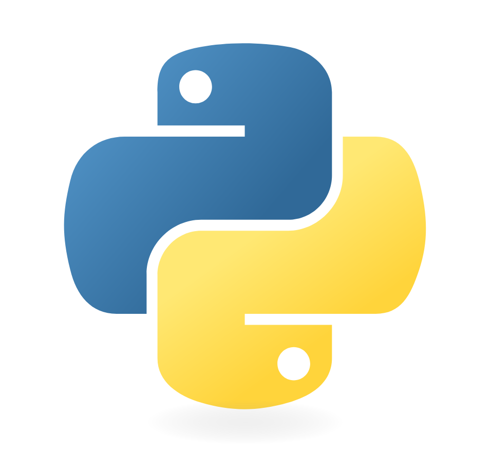
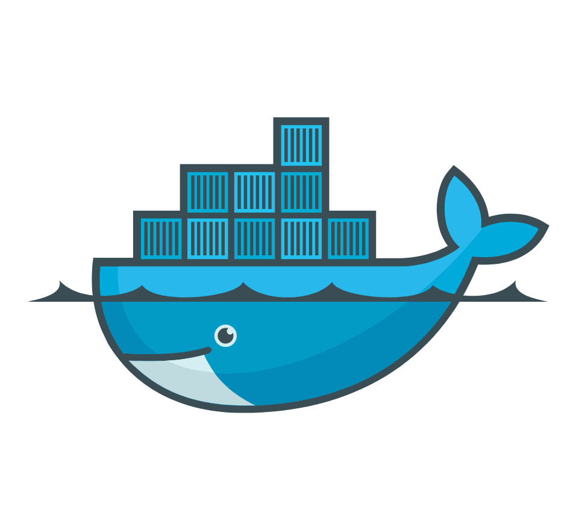
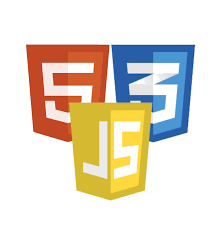
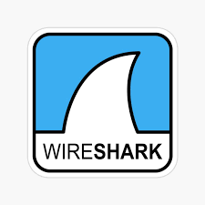
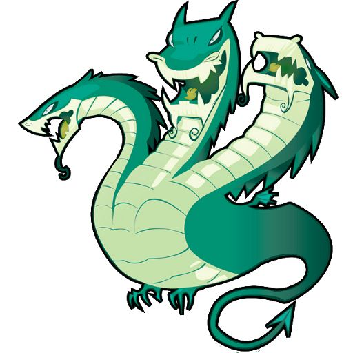
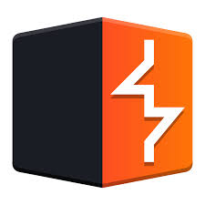
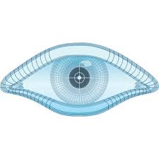

<h1 align="center">Hello I'm Mister L</h1>

  

  🔒 Cyber Security Enthusiast &nbsp;•&nbsp; 🕵️ Offensive Security Learner &nbsp;•&nbsp; 💻 Junior Web Developer

  
  
  

---

### 👾 About Me
- 🔥 Cyber Security Enthusiast exploring vulnerabilities & exploits  
- 🕵️‍♂️ Offensive Security learner | CTF & Bug Bounty hunter (learning responsibly)  
- 💻 Junior Web Developer | Passionate about building & securing web apps  
- 🔐 Fokus: Web App Security (OWASP), Recon, Exploit Dev, Binary Basics  
- 🌱 Saat ini belajar: Red Teaming, OSINT, Binary Exploitation, Burp Suite & exploit chains  
- 🎯 Goal: jadi Security Researcher / PenTester yang etis dan dapat kontribusi ke open-source security tools  
- ⚡ Fun fact: I break things... to secure them better.

---

### 🛠️ Toolbelt & Skills

  
  
  
  
  
  
  
  

**Primary**
- Languages: `Python`, `JavaScript`, `HTML/CSS`, `Bash`  
- OS: Kali Linux, Ubuntu, Windows  
- Tools: Burp Suite, nmap, Metasploit (learning), Hydra, John the Ripper (if used), Wireshark  
- Dev: Docker, Git, GitHub Actions (CI)

---

### 🧩 What I build / Projects
- **recon-automation** — Script untuk otomatisasi recon awal (subdomain, ports, screenshots). `dockerized`  
- **ctf-writeups** — Koleksi writeups (web, pwn, rev) — lengkap dengan langkah & exploit code  
- **vuln-lab** — VM/containers rentan untuk latihan exploit & patching (red-team playground, safe)  
- **secure-web-starter** — Boilerplate web app dengan basic security headers & CI checks

---

### 📚 Highlights & Certs (in-progress)
- OSCP (goal) — sedang mempersiapkan lab & latihan Pwn + Web  
- CTF: ikut beberapa event (jejak di `ctf-writeups`)  
- Bug bounty: mulai dari program public & latihan di lab

---

### 📫 Contact
- GitHub: https://github.com/rafifaiz  
- Email: `leorapi219@gmail.com`  
- Discord: https://discord.gg/MvCb8pT7
- Instagram: https://instagram.com/rapmalta_
- Tik Tok: https://www.tiktok.com/@leorapii
- Linkedin: https://www.linkedin.com/in/rafi-faiz-b15064346/

# 📊 GitHub Stats:
 
 

### ⚠️ Responsible Disclosure / Security Policy
I do **not** publish exploits that would harm real people or active systems.  
If you find a vulnerability in my projects or server, please contact me privately (PGP preferred) — I follow responsible disclosure.
